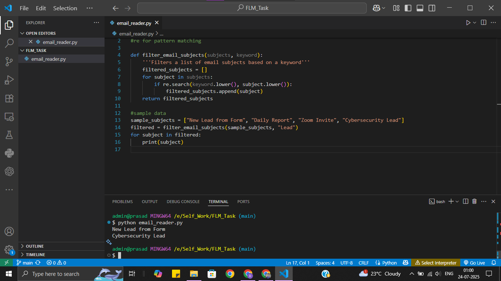

# FLM TECHNICAL TASK
## Problem:
You receive many emails every day. Write a program that filters and prints only the email subjects that contain the word "Lead" (case-insensitive).

### Input Example:
["New Lead from Form", "Daily Report", "Zoom Invite", "Cybersecurity Lead"]

### Expected Output:
New Lead from Form  
Cybersecurity Lead

### Console Ouput
